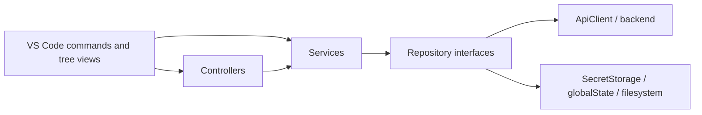
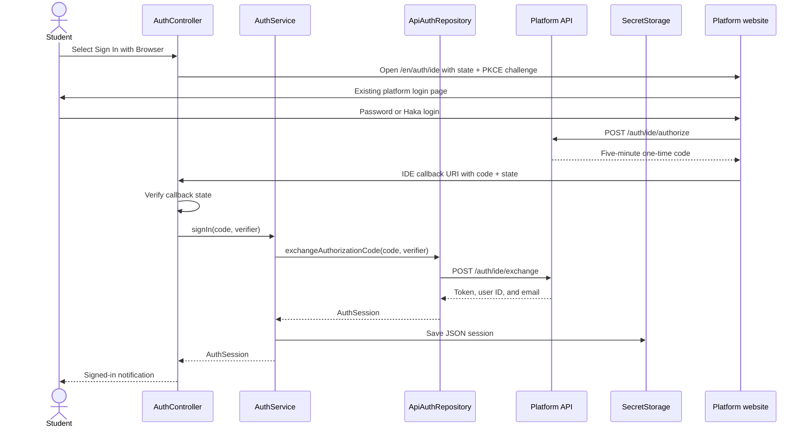
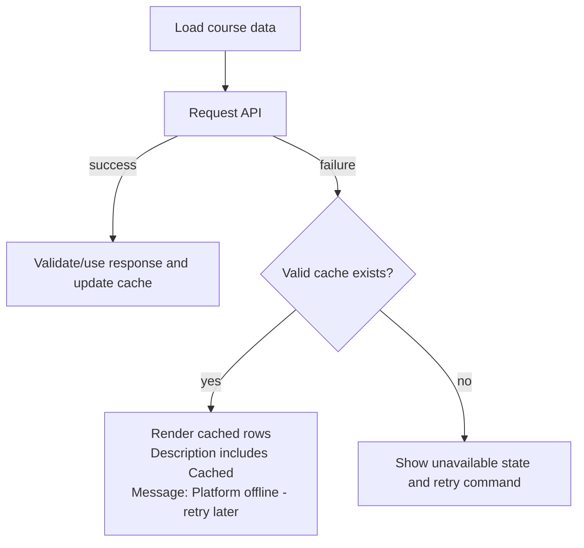
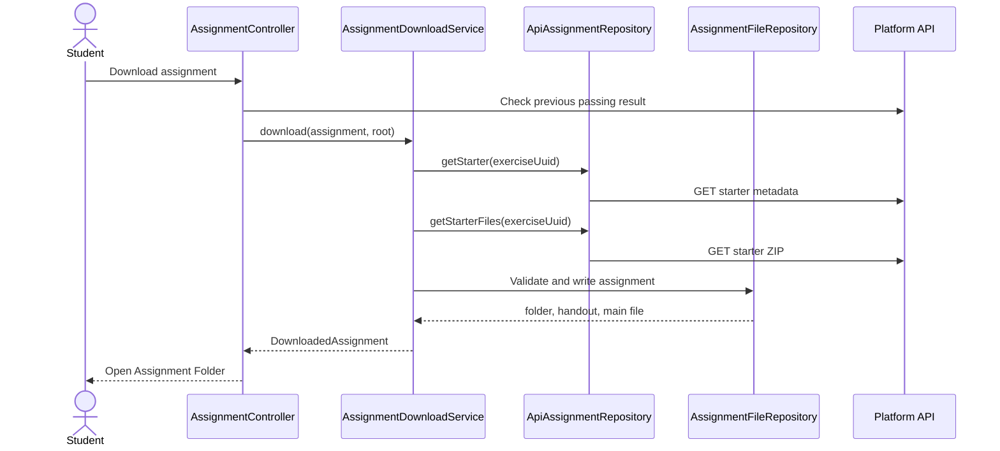
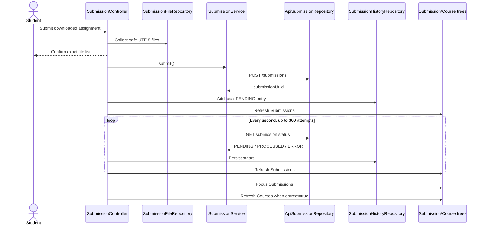

# Aalto Fitech Platform extension developer guide

This document describes the mechanics, architecture, data flow, storage, API
integration, safety rules, user interface, tests, and current limitations of the
VS Code extension. It is intended to let a new contributor understand where a
change belongs and which behavior must be preserved.

The source code is the final authority. Update this guide whenever a feature
changes its API contract, persisted schema, filesystem behavior, or ownership
boundary.

## 1. Product scope

The extension currently lets a student:

1. Check whether the platform API is available.
2. Sign in through the platform website using an available login method.
3. Select a per-student root folder for downloaded assignments.
4. Select one enrolled course and course version.
5. Browse that course's programming assignments.
6. See downloaded and completed state.
7. Download a starter archive and generated handout.
8. Open the course folder, assignment tree, and likely starter entry file.
9. Redownload an assignment after confirming that current contents will be
   replaced.
10. Submit a locally downloaded assignment.
11. Follow pending grading and inspect pass, failure, and grader-error details.
12. Reuse cached course and submission data while the platform is offline.

The backend remains authoritative for authentication sessions, enrolment,
course structure, prerequisites, submission records, grader execution, points,
and completion. The extension never calculates points or runs hidden tests.

Only exercises whose type is exactly `programming-exercise` are displayed,
downloaded, and submitted.

## 2. Architectural model

The extension uses feature-oriented TypeScript with four main roles:

| Role | Responsibility | Must not |
| --- | --- | --- |
| Controller | VS Code prompts, progress, notifications, editors, commands | Make raw API requests |
| Service | Coordinate an application workflow | Present VS Code UI |
| Repository | API, SecretStorage, global state, or filesystem access | Decide user interaction |
| Model | Feature-specific data contracts | Perform I/O |

`src/commands/registerCommands.ts` is the composition root. It constructs every
concrete dependency and is the only place that chooses mock or API
repositories.



Some simple services are intentionally thin today. They preserve the boundary
for future coordination and keep controllers independent of repository
implementations.

### Dependency construction

Activation calls:

```text
src/extension.ts
└── registerCommands(context)
    ├── configuration
    ├── persistence repositories
    ├── authenticated and public API clients
    ├── mock or API feature repositories
    ├── services
    ├── controllers
    ├── tree views
    └── VS Code commands
```

`useMockApi` is read once during activation. Changing it requires reloading the
VS Code window so the composition root can construct a different repository
graph.

The authenticated `ApiClient` receives an asynchronous token provider backed by
`SessionRepository`. The provider is evaluated before every request, so a new
sign-in token is used immediately and sign-out stops later requests from
carrying a token.

The platform-status feature uses a separate client without a token provider.
The public `/status` request must not receive a student session.

## 3. Source map

| Path | Purpose |
| --- | --- |
| `src/extension.ts` | VS Code activation entry point |
| `src/commands/registerCommands.ts` | Composition root and command registration |
| `src/config/configuration.ts` | Reads API URL, platform website URL, and mock-mode settings |
| `src/infrastructure/apiClient.ts` | Shared HTTP, authentication header, timeout, and error handling |
| `src/features/auth` | Browser login, PKCE code exchange, and secure session persistence |
| `src/features/courses` | Enrolments, course/version selection, course cache, selection view, and Course Parts tree |
| `src/features/courseMaterials` | Course structure and exercise models |
| `src/features/assignments` | Folder/current-exercise persistence, starter download, ZIP extraction, and Exercise file tree |
| `src/features/account` | Compact Account Quick Pick and actions |
| `src/features/coursePoints` | Selected-course progress API mapping |
| `src/features/submissions` | File collection, upload, polling, history, result parsing, and Submissions tree |
| `src/features/platformStatus` | Public availability check |
| `src/features/development` | Development-only completion simulation and reset |
| `src/views/registerViews.ts` | Setup and four working-view wiring |
| `src/test` | VS Code extension-host tests and local fakes |
| `package.json` | Commands, views, menus, welcome states, settings, and Marketplace metadata |
| `esbuild.js` | Development/production bundles and development-tool removal |

## 4. VS Code user interface

The extension contributes one Activity Bar container. Before setup it shows
Authentication and Assignment Folder sequentially. After setup it shows four
collapsible native views:

- **Course Selection**
- **Course Parts**
- **Exercise**
- **Submissions**

Account is a toolbar Quick Pick rather than a permanent view.

Native views, Quick Picks, input boxes, folder pickers, notifications, and text
editors are used instead of a Webview. This gives the extension standard VS
Code keyboard, theme, zoom, and screen-reader behavior.

### Registered commands

| Command ID | Owner and effect |
| --- | --- |
| `aaltoFitechPlatform.checkPlatformStatus` | Public platform-status check |
| `aaltoFitechPlatform.signIn` | Browser login, code exchange, session save, and full UI refresh |
| `aaltoFitechPlatform.showCurrentUser` | Shows current student identity |
| `aaltoFitechPlatform.signOut` | Clears session and refreshes UI |
| `aaltoFitechPlatform.showAccount` | Shows identity, optional points, folder change, and sign-out actions |
| `aaltoFitechPlatform.selectAssignmentFolder` | Explains and selects per-student root |
| `aaltoFitechPlatform.selectCourse` | Selects course and instance/version |
| `aaltoFitechPlatform.refreshCourses` | Reloads selection and Course Parts |
| `aaltoFitechPlatform.selectAssignment` | Sets the per-user current exercise |
| `aaltoFitechPlatform.refreshExercise` | Reloads the current local file tree |
| `aaltoFitechPlatform.downloadAssignment` | Downloads selected programming assignment |
| `aaltoFitechPlatform.showAssignmentFolder` | Reveals local folder in the operating system |
| `aaltoFitechPlatform.redownloadAssignment` | Confirms and replaces selected download |
| `aaltoFitechPlatform.submitAssignment` | Confirms files, uploads, and follows grading |
| `aaltoFitechPlatform.refreshSubmissions` | Synchronizes and reloads Submissions |
| `aaltoFitechPlatform.openSubmissionDetails` | Opens virtual Markdown failure details |

Development builds additionally register
`aaltoFitechPlatform.development.markAssignmentComplete`.

### Welcome-view state

`package.json` displays state-specific welcome content using context keys:

| Context key | Meaning |
| --- | --- |
| `aaltoFitechPlatform.signedIn` | A valid session exists in SecretStorage |
| `aaltoFitechPlatform.assignmentFolderSelected` | Current student has a stored assignment root |
| `aaltoFitechPlatform.courseSelected` | Current student has a stored course/version selection |
| `aaltoFitechPlatform.setupComplete` | Session and assignment root both exist |
| `aaltoFitechPlatform.currentAssignmentSelected` | Current student has selected an exercise |
| `aaltoFitechPlatform.currentAssignmentDownloaded` | Current exercise has matching local metadata |

`refreshUiState()` in the composition root updates these keys and refreshes
all tree providers. Call it after login, logout, assignment-root selection, or
course/current-exercise selection.

### Tree-item action state

The Course Parts tree sets `TreeItem.contextValue`, which controls commands declared
under `view/item/context` in `package.json`:

| Context value | Meaning | Main inline action |
| --- | --- | --- |
| `programmingExercise` | Not downloaded and not complete | Download |
| `downloadedProgrammingExercise` | Downloaded and not complete | Submit |
| `completedProgrammingExercise` | Complete but not downloaded | Download |
| `completedDownloadedProgrammingExercise` | Complete and downloaded | Show local folder |

Submit, show-folder, and redownload remain available through contextual menus
where applicable. Assignment-only commands are hidden from the Command Palette
because they require a tree item containing a `ProgrammingAssignment`.

### Accessibility mechanics

Tree rows have `accessibilityInformation` that announces:

- Part, chapter, and assignment completion.
- Current-exercise and local-file state.
- Assignment download state.
- Submission result and submission time.
- Failed tests, grader errors, and detail actions.

Failed-test details open as selectable Markdown in a native virtual document.
See `docs/accessibility-review.md` for the code review and remaining manual
checks.

## 5. Configuration

| Setting | Current default | Read by |
| --- | --- | --- |
| `aaltoFitechPlatform.apiBaseUrl` | `http://localhost:8842/api` | `getApiBaseUrl()` |
| `aaltoFitechPlatform.platformBaseUrl` | `http://localhost:7799` | `getPlatformBaseUrl()` |
| `aaltoFitechPlatform.useMockApi` | `true` | `useMockApi()` |

All settings use machine scope.

Local real-API development normally uses:

```json
{
  "aaltoFitechPlatform.apiBaseUrl": "http://localhost:8842/api",
  "aaltoFitechPlatform.platformBaseUrl": "http://localhost:7799",
  "aaltoFitechPlatform.useMockApi": false
}
```

Reload the Extension Development Host after changing mock mode.

## 6. HTTP behavior and backend endpoints

`ApiClient` supports JSON GET, JSON POST, multipart POST, and byte downloads.

Shared behavior:

- Request timeout: 10 seconds.
- Authenticated calls send the raw session token as `Authorization`.
- Do not add a `Bearer ` prefix; the current backend middleware expects the raw
  token.
- A non-2xx JSON response preserves a non-empty backend `message`.
- Non-JSON or malformed errors become
  `API request failed with status <status>.`
- Timeouts become `The API request timed out.`

Current endpoints:

| Method | Endpoint | Authentication | Used for |
| --- | --- | --- | --- |
| GET | `/status` | No | Platform availability |
| POST | `/auth/ide/authorize` | Browser platform session | Create a one-time PKCE-bound code |
| POST | `/auth/ide/exchange` | One-time code + verifier | Create the extension session |
| GET | `/users/enrolments-by-course` | Yes | All student course enrolments |
| GET | `/course-materials/:courseSlug/structure` | Yes | Parts, chapters, and exercises |
| GET | `/points/courses/:courseSlug/progress` | Yes | Optional Account points line for selected instance |
| GET | `/exercises/:exerciseUuid/starter` | Yes | Starter metadata and handout |
| GET | `/exercises/:exerciseUuid/starter/files` | Yes | ZIP starter archive |
| POST | `/submissions` | Yes | Multipart source submission |
| GET | `/submissions/status/:submissionUuid` | Yes | Current grader status |
| GET | `/submissions/:exerciseUuid?instanceId=<id>` | Yes | Completion and submission history |

Submission multipart fields:

| Field | Value |
| --- | --- |
| `exerciseUuid` | Platform exercise UUID |
| `courseSlug` | Selected course slug |
| `data` | JSON object mapping relative path to UTF-8 source text |

The response validators in repositories treat all backend JSON as untrusted.
When changing a backend response, update the model, validation/mapping code, and
focused tests together.

Completion checks call the per-exercise submission endpoint with `light=true`
and return true when any record has `correct: true`. Full history
synchronization omits `light` so grader status and grader data are available.

## 7. Authentication

### Current login contract

The extension opens the existing platform login page. Password and Haka login
both return to the same authorization page:



`ApiAuthRepository` maps the backend's flat response into:

```ts
{
  token: string;
  student: {
    id: number;
    email: string;
  };
}
```

The successful backend response contract is:

```ts
{
  token: string;
  id: number;
  email: string;
}
```

The extension displays the email as the account identity. It keeps the numeric
user ID for per-user assignment folders, course selections, and caches.
Backend failures commonly use `{ "auth": false, "message": "..." }`; the
shared API client presents a non-empty `message` to the controller.

### Session persistence

The JSON session is stored in VS Code `SecretStorage` under:

```text
aaltoFitechPlatform.authSession.v2
```

`SessionRepository.get()` parses and validates every field. Invalid JSON or an
invalid structure is treated as signed out and deleted.

Sign-out deletes only the session. It intentionally keeps per-student folder
selection, course selection, and cached data so returning students can resume.

The callback never contains a platform session token. The random state protects
the callback request, PKCE binds the authorization code to its initiating VS
Code instance, and the backend invalidates the code after one successful
exchange or five minutes.

## 8. Account and assignment-root selection

Account is intentionally not a permanent view. The account icon in each working
view toolbar opens a native Quick Pick containing identity, the current folder,
optional selected-course points, Change Assignment Folder, and Sign Out.

Assignment-root selection is mandatory before working views become available. When
the selection command runs, the controller explains what the folder is, opens a
folder picker, and lets the student defer the choice. The setup view continues
to prompt for a folder until one is stored.

The selected path is stored per student:

```text
aaltoFitechPlatform.assignmentDownloadRoot.v2.<userId>
```

This prevents one account from inheriting another account's chosen folder.

When a course/version is selected, Account requests
`GET /points/courses/:courseSlug/progress`, matches `instance_id`, and shows
earned/max points and percentage. Failure or a missing row simply omits points.

## 9. Course and version selection

The selection flow:

1. Require a current session.
2. Request `/users/enrolments-by-course`.
3. Save successful enrolments to the per-student cache.
4. If the API fails, offer validated cached enrolments when available.
5. Ask the student to choose a course.
6. Ask for one instance/version of that course.
7. Save `{ courseSlug, courseInstanceId }` per student.
8. Refresh context keys and all views.

The selection key is:

```text
aaltoFitechPlatform.courseSelection.v1.<userId>
```

Course instance IDs are part of completion, history, development overrides, and
download metadata. Do not remove the instance from those identities.

## 10. Course Parts, current exercise, and completion

The Course Parts tree loads only after this state chain is satisfied:

```text
valid session
→ assignment root selected
→ course/version selected
→ selected enrolment still exists
→ course structure available from API or cache
```

The provider filters the structure:

```text
course parts
└── chapters containing programming exercises
    └── programming exercises only
```

Part and chapter names come from the backend. Empty chapters and parts are
removed after filtering.

For each programming assignment, the provider checks in parallel:

- Whether a matching local metadata file exists.
- Whether the backend reports any correct submission for the selected course
  instance.

Backend completion is cached. Development builds can also apply an in-memory
completion override. A chapter is complete when all visible programming
assignments are complete; a part is complete when all of its visible chapters
are complete.

After a submission passes, `SubmissionController` refreshes Courses
immediately. This makes assignment, chapter, and part icons update without a
manual reload.

Selecting a programming assignment stores it under:

```text
aaltoFitechPlatform.currentAssignment.v1.<userId>
```

The selection is marked **Current** and drives both Exercise and Submissions.
Exercise projects the downloaded folder as a native file tree, hides the
internal `.aalto-fitech-assignment.json`, watches for changes, and opens files
with `vscode.open`. A Submit Current Exercise action is rendered above the file
tree only for a valid download. Selecting another exercise changes views but
does not open a file automatically.

## 11. Course caching and offline behavior

`CourseCacheRepository` stores validated per-student data:

```text
aaltoFitechPlatform.courseCache.v1.enrolments.<userId>
aaltoFitechPlatform.courseCache.v1.structure.<userId>.<courseSlug>
aaltoFitechPlatform.courseCache.v1.passed.<userId>.<instanceId>.<exerciseUuid>
```

Network-first behavior:



Offline mode is read-only fallback. It does not queue downloads or submissions.

## 12. Assignment download

### Download data flow



The controller warns when the backend says the assignment is already complete,
but the student may choose **Download Anyway**.

### Local folder contract

```text
<student-selected-root>/
└── <sanitized-course-slug>/
    └── <sanitized-assignment-name>/
        ├── assignment-handout.md
        ├── starter files...
        └── .aalto-fitech-assignment.json
```

Folder names are Unicode-normalized, lowercased, stripped of unsafe characters,
limited to 80 characters, and protected against reserved Windows device names.

The metadata file contains:

```json
{
  "schemaVersion": 1,
  "exerciseUuid": "...",
  "exerciseType": "programming-exercise",
  "courseSlug": "...",
  "courseInstanceId": 123
}
```

This file is required to recognize a folder as an extension download. It is also
the trust link that prevents submitting an arbitrary folder as another
assignment.

### ZIP safety

`AssignmentFileRepository` enforces:

- Maximum archive size: 20 MB.
- Maximum extracted content: 50 MB.
- Maximum files: 500.
- CRC checking.
- No absolute paths, drive paths, `.`/`..`, invalid Windows characters, or
  trailing spaces/dots.
- No symbolic links.
- No duplicate case-insensitive paths.
- No collision with extension metadata or generated handout.
- Extraction into a random temporary sibling folder before final rename.

Never move these checks into the controller or bypass them for a new download
entry point.

### Opening a download

**Open Assignment Folder** adds the sanitized course-slug folder to the current
workspace, not the individual assignment folder. It then:

1. Selects a likely starter file.
2. Opens that file as a non-preview editor.
3. Focuses Explorer.
4. Reveals the file so the assignment hierarchy is expanded.

Preferred file order:

1. `index.html`
2. `main.*`
3. `index.*`
4. `app.*`
5. Another recognized source file, preferring shallower paths
6. `assignment-handout.md`

Generated directories such as `node_modules`, `dist`, `build`, `coverage`, and
`target` are skipped during discovery.

### Redownload

Redownload is intentionally destructive and requires the exact modal action
**Overwrite and Redownload**.

The repository prepares and validates the fresh assignment in a temporary
folder before touching current work. It then:

1. Temporarily renames the current assignment.
2. Renames the fresh folder into the official location.
3. Restores the old folder if installation fails.
4. Permanently deletes the temporary old folder after success.

No timestamped backup remains. Student edits and added files are lost after a
successful confirmed redownload.

## 13. Submission file collection

Submission is allowed only when `.aalto-fitech-assignment.json` matches the
selected exercise, type, course slug, and course instance.

`SubmissionFileRepository` recursively collects UTF-8 text files.

Excluded root files:

- `.aalto-fitech-assignment.json`
- `assignment-handout.md`
- `.DS_Store`

Excluded directories:

- `.git`
- `.vscode`
- `node_modules`
- `dist`
- `build`
- `coverage`

Safety limits:

- At most 500 files.
- At most 1 MB total.
- No symbolic links.
- No binary or invalid UTF-8 files.
- No unsupported or ambiguous path segments.

The current policy submits every remaining text file. It does not yet compare
files with a backend solution manifest. This policy is an explicit unresolved
product decision because some assignments require students to add new files.

Before upload, the controller shows the exact file list, truncated visually
after 20 entries, and requires **Submit** confirmation.

## 14. Submission and grading flow



Polling lasts at most approximately five minutes. Cancelling progress stops the
foreground polling but keeps the persisted pending entry. A later Submissions
refresh requests its current backend status.

Grading status validation accepts:

- `PENDING`
- `PROCESSED`
- `ERROR`

`correct` may be `true`, `false`, or `null`. `gradingData` may be an object or
`null`.

## 15. Submission history and result details

Local history is stored under:

```text
aaltoFitechPlatform.submissionHistory.v1
```

Entries contain `userId`, so views filter records for the current student.
History is sorted newest-first, deduplicated by submission UUID, structurally
validated on read, and limited to 50 total cached entries.

When the Submissions view loads:

1. Determine the current user, course/version, and current exercise.
2. Fetch current course structure.
3. Find programming exercises.
4. Fetch backend history for each exercise and selected instance.
5. Join exercise names with submission records.
6. Merge results into local history.
7. Refresh any still-pending entries.
8. Filter visible rows to the current exercise.
9. Keep cached rows and show an offline message if synchronization fails.

Only the selected course/version is synchronized, and only the current
exercise's submissions are rendered.

The view shows:

- Two newest submissions at the root.
- Remaining entries under **Past Submissions**.
- `Pending`, `Passed`, `Failed`, or `Grading error`.
- Failed tests and grader errors as direct children.

`submissionResult.ts` accepts several grader naming variants:

- Test name: `testName`, `name`, or `title`.
- Details: `test output`, `testOutput`, `error`, `message`, or `output`.
- Grader errors: `error`, `testErrors`, or `testErrorsOutput`.

Selecting a failure opens a virtual read-only Markdown document using the
`aalto-fitech-submission` URI scheme. The document exists in memory only.

## 16. Platform status

**Check Platform Status** calls the public `/status` endpoint with an
unauthenticated client.

The service converts all errors into a boolean. The controller reports only
available or unavailable; it intentionally does not reveal endpoint details or
raw backend errors.

## 17. Mock mode

When mock mode is enabled, the composition root substitutes:

- `MockAuthRepository`
- `MockCourseRepository`
- `MockCourseMaterialRepository`
- `MockCoursePointsRepository`
- `MockAssignmentRepository`
- `MockSubmissionRepository`

The API URL is still used by the public platform-status client.

Mock authentication signs in immediately with the demo account email without
opening the platform website. Seeing the demo account while testing browser
login means mock mode was still enabled when the extension activated.

## 18. Development-only tools

Development builds show an **Aalto Fitech Test Tools** status-bar item. It can:

- Mark a programming assignment complete in memory.
- Clear in-memory completion overrides.
- Reset all extension test data.

Completion keys contain user, course slug, course instance, and exercise UUID.
They are never persisted.

Reset clears:

- Session SecretStorage.
- Every stored assignment root.
- Every course selection.
- Every current-exercise selection.
- Course caches.
- Submission history.
- Development completion overrides.

It does not delete downloaded assignment files or backend records.

`esbuild.js` defines `__DEVELOPMENT_TOOLS__` as `false` in production. Dead-code
elimination removes the development UI and behavior from the production bundle.

## 19. Persistence summary

| Data | Storage | Scope | Cleared by sign-out? |
| --- | --- | --- | --- |
| Authentication session/token | SecretStorage | Current installation | Yes |
| Assignment root | globalState | Per student | No |
| Course/version selection | globalState | Per student | No |
| Current exercise | globalState | Per student | No |
| Enrolments and course structure cache | globalState | Per student/course | No |
| Completion cache | globalState | Per student/instance/exercise | No |
| Submission history cache | globalState | Entries identify student | No |
| Development completion | Memory | Per user/instance/exercise | N/A |
| Downloaded starter/work | Student-selected filesystem | Course/assignment | No |
| Failure detail documents | Memory | Current extension host | N/A |

Closing, reloading, updating, or disabling the extension preserves persistent
state. Signing out removes only the authentication session.

`ExtensionLifecycleService` stores an installation marker in the extension's
VS Code `globalStorage` directory. VS Code removes that directory after the
extension is completely uninstalled. If a later installation finds that the
marker disappeared while the lifecycle marker in `SecretStorage` or
`globalState` survived, activation clears all extension-owned secrets and
global state before registering commands. This handles stores that VS Code may
retain beyond uninstall without confusing an ordinary update with a reinstall.

The first version containing this mechanism treats missing lifecycle markers as
a migration and preserves existing data. It then creates the markers used by
future reinstalls.

Lifecycle cleanup never follows the path stored as the assignment root and
never deletes downloaded assignment files. It also cannot delete backend
accounts, submissions, or scores.

All persisted JSON-like values must be validated when read. Follow the existing
type-guard pattern when adding a schema.

Version persisted keys when changing an incompatible structure. Do not silently
reinterpret old data.

## 20. Error and refresh behavior

Controllers translate exceptions into student-facing notifications.
Repositories and services throw ordinary errors without showing UI.

Refresh behavior:

- Authentication/folder/course changes call the shared full UI refresh.
- Course refresh fires Course Selection and Course Parts events.
- Current-exercise changes refresh Course Parts, Exercise, and Submissions.
- Exercise watches its current local folder and also has a manual refresh.
- Submission refresh fires the Submissions tree event.
- Download/redownload makes the assignment current and refreshes its file tree.
- A passing grader update refreshes Course Parts so assignment/chapter/part
  completion changes immediately.
- Submission status changes refresh Submissions during polling.

Avoid swallowing errors unless a documented fallback exists. Current deliberate
fallbacks include:

- Cached courses and completion.
- Cached submission history.
- Treating a failed pre-download completion check as not yet passed.
- Platform status reducing all failures to unavailable.

## 21. Security and privacy invariants

Preserve these rules:

- Never log session tokens, user UUIDs, or student source contents.
- Store tokens only in SecretStorage.
- Send the token only to the configured API and only as the raw Authorization
  value required by the current backend.
- Submit source only after an explicit file-list confirmation.
- Require matching download metadata before submission.
- Do not follow symbolic links during extraction or submission.
- Do not allow ZIP paths outside the assignment directory.
- Do not expose hidden tests.
- Do not calculate points or grading locally.
- Do not silently overwrite student work; destructive redownload requires a
  modal warning and explicit action.
- Do not add telemetry without a separate disclosure and consent decision.

## 22. Build, test, and packaging

Common commands:

```bash
npm install
npm run check-types
npm run lint
npm run compile
npm test
npm run package
```

`npm test`:

1. Compiles tests into `out`.
2. Compiles the extension.
3. Runs ESLint.
4. Launches a VS Code Extension Development Host.
5. Executes the Mocha suites under `src/test`.

Tests use in-memory SecretStorage/Memento fakes, temporary folders, ZIP fixtures,
and a local HTTP server. They do not require the platform database or grader.

The current focused suites cover:

- Authentication mapping, persistence, corruption, and sign-out.
- Raw authorization headers, backend errors, JSON, and byte downloads.
- Per-user course/folder state, structure, completion, and offline cache.
- ZIP extraction, metadata, path traversal, open-file selection, and
  transactional redownload.
- Submission collection, multipart upload, history, polling, errors, caching,
  grouping, and result parsing.
- Current-exercise persistence, file-tree projection, and submission scoping.
- Platform availability.
- Development completion scope.

GitHub Actions runs installation, type checking, linting, extension-host tests,
and production packaging on Ubuntu, macOS, and Windows. Linux uses Xvfb for the
Electron test host.

The production entry point is `dist/extension.js`. Source, tests, CI files,
development diary, source maps, and local tooling are excluded from the VSIX by
`.vscodeignore`.

## 23. Adding or changing a feature

Use this sequence:

1. Identify the owning feature folder.
2. Add or change models for external/persisted contracts.
3. Put backend or persistence access behind a repository interface.
4. Add service coordination when the operation has multiple steps.
5. Keep VS Code interaction in a controller or tree provider.
6. Wire concrete dependencies only in `registerCommands.ts` or
   `registerViews.ts`.
7. Add command/menu/welcome contributions in `package.json`.
8. Refresh the correct context keys and tree providers after state changes.
9. Add focused tests using local fakes or the local HTTP server.
10. Update this guide and README when behavior visible to students or coders
    changes.

When adding a new API endpoint:

1. Add the repository method and response validation.
2. Reuse the authenticated `ApiClient` unless the endpoint is explicitly
   public.
3. Confirm whether course instance is required.
4. Test both the request contract and malformed/error responses.
5. Document the endpoint in this guide.

When adding persisted data:

1. Include a schema version in the key or value.
2. Scope student-specific data by numeric student ID.
3. Validate unknown data on read.
4. Define sign-out and development-reset behavior.
5. Test restoration using a new repository instance.
6. Test corrupt data.

## 24. Current limitations and decisions still open

- The browser authentication flow still requires full production deployment
  and security review.
- The production API URL is not approved.
- Mock mode still defaults to `true`.
- Marketplace publisher and project license require confirmation.
- Submission currently includes every safe text file; final language-specific
  or solution-manifest rules are undecided.
- Only the selected course/version has synchronized submission history.
- Offline mode does not queue mutations.
- The extension relies on the backend's current grader-data shapes and supports
  known field variants defensively.
- Manual end-to-end, screen-reader, clean-VSIX, and upgrade testing remain
  release tasks.

Treat these as explicit project decisions, not accidental omissions. Discuss
them before broadening the implementation.
